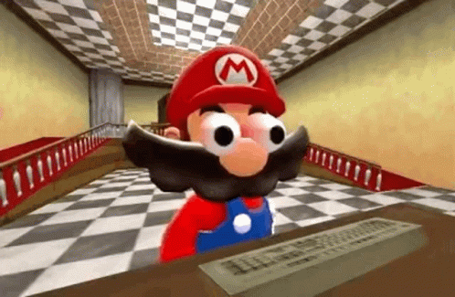

# SUPER MARIO WORLD AI mAIro
Projeto de IA com o objetivo de aplicar diversos conhecimentos desta importante área da computação

## Objetivo

Conseguir demonstrar o domínio de técnias de relacionadas ao tema de Inteligência Artificial como aprendizado de máquina, visão computacional, interação entre o algoritimo e interface...

## Ferramentas

- SNES9X: emulador de super nitendo com uma interface simples e amigável com ótimo desempenho
- Super Mario World ROM: arquivo do game para o emulador
- Python 3: linguagem adotada
- OpenCV: para a interpretação do que está ocorrendo na tela do jogo
- Pyautogui: enviar os inputs do joystick controlado pela AI

Parece muita coisa, não é?

Relaxa, vamos quebrar em partes para resolver.

### Importações e Instalações
- [SNES9X](https://www.snes9x.com/downloads.php)
- [Python 3](https://www.python.org/downloads/)

*PACOTES*:
- python -m pip install opencv-python
- python -m pip install pillow

## Implementação

### Etapas e Explicação

1. Configurar o ambiente
1. Dar olhos para nossa AI
1. Configurar os inputs
1. Ajustar pesos e recompensa
1. Multi-threading para treino da AI
1. Treino da AI

### Identificar o Mario na Tela

Usando o OpenCV e exemplos de alguns possíveis estados para o Mario, é possível achar onde ele se encontra na tela e também o seu estado atual (PowerUps, Montado ou não no Yoshi, Pulando, Abaixado).

[Lista de Softwares](https://smartone.ai/blog/top-10-open-source-data-labeling-tools-for-computer-vision/) para adicionar legendas nas imagens

[Como nomear imagens de treino](https://research.aimultiple.com/computer-vision-training-data/)

[Todas as Sprites do SMW](https://www.spriters-resource.com/snes/smarioworld/)

#### Imagens para treinamento

As imagens para treinar a AI foram categorizadas uma a uma usando uma ferramenta de "annotations" open source